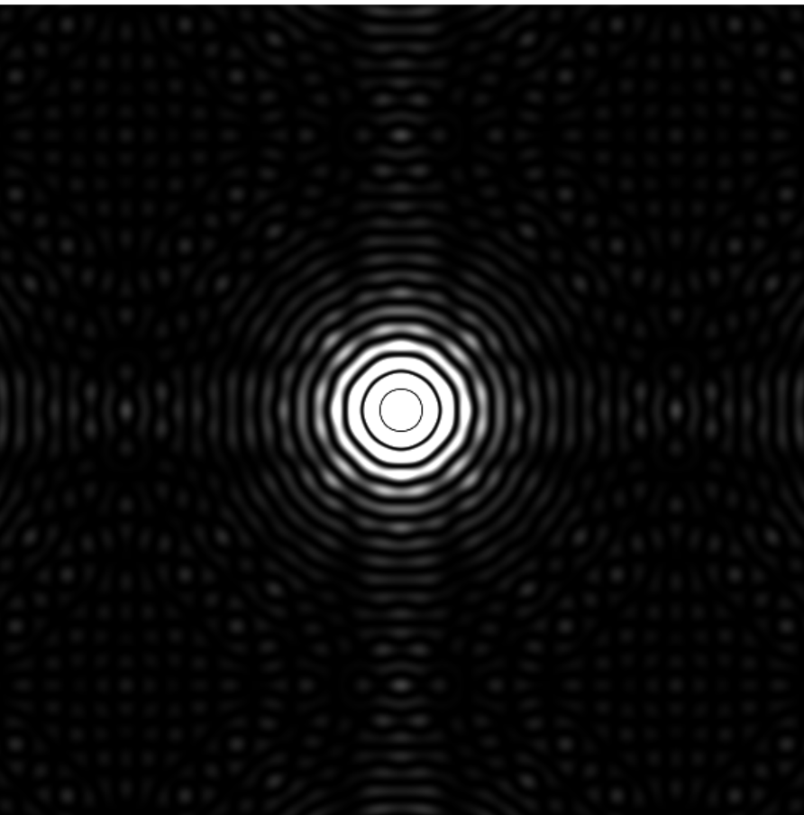

# 单色光的远场衍射模拟
   这是我用[taichi](https://github.com/taichi-dev/taichi)写的一个求衍射图案的作业(可能有错误的地方)
## 运行结果

## 整体结构
   这个作业主要用到了[太极图形课](https://www.bilibili.com/video/BV1aL4y1a7pv?p=1)02讲中的面向对象编程，在[衍射类.py](./衍射类/衍射类.py)中定义了衍射屏、衍射小孔和格子这三个类，在其余文件中调用这些类的方法来计算衍射图案
## 运行方式
   [衍射类](./衍射类)中的文件都可以直接在python中运行,其中[方块衍射.py](./衍射类/衍射类.py)是一个可以交互的程序，在运行时按住鼠标左键可以在Hole窗口绘制想要的小孔形状，Screen窗口显示衍射结果,c是清除所有方块

